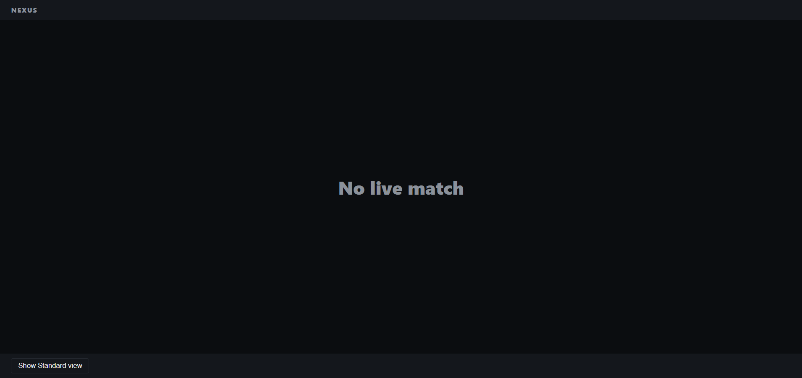
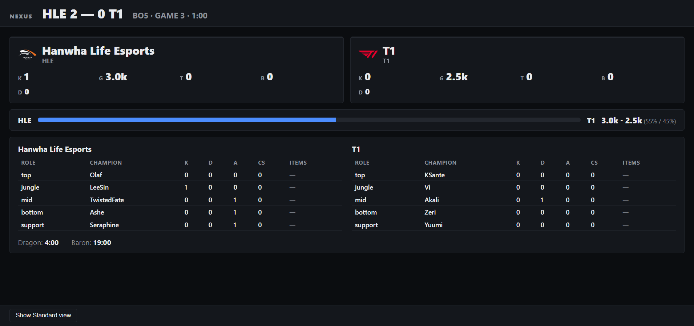

# Module 2: Build and Ship a Full-Stack App with AI Coding Assistants

## Steps Taken
1. Reused module 1 workflow (DeepSeek as architect, OpenCode as builder)
2. Answered ~15 design questions which produced `specs.md`, three `AGENTS.md` files and `openapi.yaml` from the spec
3. Reviewed the frontend prototype; found minor issues and confirmed all four states rendered before moving on
4. OpenCode: one task per session, stop and report before the next (made spec and instructions as detailed as possible)
5. Discussed and verified each report with DeepSeek before continuing to the next task
6. Recorded a live match and ran the replay to confirm scoreboard animates the data

The biggest takeaway: the spec was worth more than the prompts. Once `specs.md` and `openapi.yaml` existed, the builder had almost nothing to decide.
Resources: DeepSeek as architect, OpenCode as builder, Riot's public lolesports feed.

## Key Artifacts
- `_docs/specs.md`: goals, non-goals, design rationale; authoritative for design
- `AGENTS.md`: (root, backend, frontend); procedure and constraints for coding agents
- `openapi.yaml`: the API contract; both runtimes are built against it; neither drifts
- `replays/`: recorded match data so the demo runs without a live game

## API Key (live mode only)
Paste into `backend/.env` as `RIOT_API_KEY`: `0TvQnueqKa5mxJntVWt0w4LpLfEkrV1Ta8rQBb9Z`
File is gitignored. Riot may rotate this free and public key without notice (403 means it changed). lolesports.com no longer exposes it in DevTools since migrating to GraphQL. Replay mode needs no key.

## Modes
Live Mode:
```
Requires a real RIOT_API_KEY in backend/.env.
If no match is live, shows "No live match".
```

### Terminal 1

#### Replay Mode
```powershell
cd homework_2\backend
$env:POLL_SOURCE="replay"
$env:REPLAY_FILE="replays/lck-2026-09-12-hle-vs-t1-g3.json"
uv run nexus
```

#### Live Mode
```powershell
cd homework_2\backend
uv run nexus
```

### Terminal 2
```powershell
cd homework_2\frontend
$env:VITE_USE_MOCK="false"
npm run dev
```

Open http://localhost:5173.

## Snapshots



